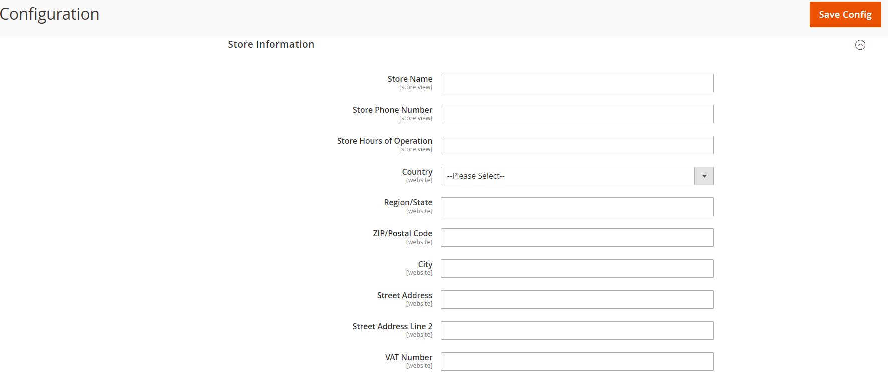

# List the main configurations

Original Link : [https://bsscommerce.com/confluence/magento-2-pricing/#5-2-price-scope](https://bsscommerce.com/confluence/magento-2-pricing/#5-2-price-scope)

## **1. Regular Price and Advanced Pricing** <a href="#1-regular-price-and-advanced-pricing" id="1-regular-price-and-advanced-pricing"></a>

Regular price: is the product’s original price which is used to calculate discounts.

Advanced pricing: allows store owners to offer Magento 2 special price of the product based on customer groups, sales, or quantity.


Advanced pricing works well with simple, bundle, virtual, and downloadable products. Grouped, configurable products and gift card are except.


### 1.1. Price Display Settings <a href="#1-1-price-display-settings" id="1-1-price-display-settings"></a>

To set up price display, please navigate to Admin ⇒ Stores ⇒ Configuration ⇒ Sales ⇒ Tax.

#### **1.1.1. Configure Price Display Settings**

Expand the Price Display Settings Section.


In **Display Product Prices In Catalog** and **Display Shipping Prices**: You decide whether product prices are included tax or not when showing them on the frontend.

* Excluding tax
* Including tax.
* Including and Excluding Tax

#### **1.1.2. Shopping Cart Display Settings**

In the Tax section, you continue to expand the Shopping Cart Display Setting section.


In **Display Prices, Display Subtotal, and Display Shipping Amount:** select Including Tax, Excluding Tax, or Including and Excluding Tax to determine how prices are displayed in terms of tax.

In **Include Tax In Order Total:** choose Yes or No to decide whether tax is included in Order Total or not.

In **Display Full Tax Summary**: choose Yes or No to decide whether full tax summary is displayed in the shopping cart.

In **Display Zero Tax Subtotal**: choose Yes or No to display or hide zero tax subtotal in the shopping cart.

### 1.2. Price Decimal <a href="#1-2-price-decimal" id="1-2-price-decimal"></a>

The **«Price Decimal Precision»** Magento 2 extension allows a store administrator to setup a custom display decimal precision for the prices and other currency values (discounts, taxes, sales amounts, etc.) both for the frontend and the backend areas. The price display settings are individual per currency and per store. The extension supports an unlimited number of currencies.

<figure><figcaption></figcaption></figure>

The **«Price Decimal Precision»** extension allows you to change or delete the decimal number (precision) in a price, that is displayed in the front office of your store. The extentension supports multi store and multi website configuration and can be useful in managing multiwebsites / multisore shops. The \*\* "Price Decimal Precision" \*\* extension is a free and fully configurable and can be helpful for your business.

#### What can the extension do for you?

**Remove decimal precision from price**

<figure><figcaption></figcaption></figure>

**Price with one decimal precision**

<figure><figcaption></figcaption></figure>

#### Features

* Free and open source and fully configurable extension;
* Easy to install and unistall;
* Easy to configurate;
* Remove or change the price precision from a specific website or store;
* Supports English translation.

#### Configuration

```
Stores -> Configuration -> Catalog
```

## **2. Special Price** <a href="#2-special-price" id="2-special-price"></a>

### 2.1. Definition <a href="#2-1-definition" id="2-1-definition"></a>

Beside running price rules to discount products, you can also use Magento 2 special prices to give promotional product prices for customers during a specific period of time. Magento 2 special prices are displayed on the product pages and category pages, and more highlighted than the regular prices. For Magento 2 configurable product prices, special prices are shown on the product pages when customers select custom options.

> In Magento Commerce edition, you can schedule Magento 2 special price on a period by using Scheduled Update configurations.


If Magento 2 special prices do not appear on the frontend, you should check the following issues:

* Reindex to update in the database if prices in the catalog are not correct.
* Cache is flushed or not?
* Customers have system cache or not?
* Prices are affected by other variables or not? (like store view, currency,…)


### 2.3. Customization <a href="#2-3-customization" id="2-3-customization"></a>

If you want to use a fixed percentage, and also display this discount percentage on the product page, Magento now does not support it.\
Hence, you can consider installing Product Label extension to add labels for products or use code to change the logic in the template. Please read this topic on Stack exchange to know how it can be resolved.\
Most conveniently, you can now grant different prices of each product to a specific customer or customer group. With Price per Customer, price segmentation becomes a piece of cake, and your customers are given the treat they deserve!

## **3. Tier Price and Group Price** <a href="#3-tier-price-and-group-price" id="3-tier-price-and-group-price"></a>

### 3.1. Definition

Tier Price: allows you to provide a quantity discount for products from the catalog list or product page details. This kind of discount is applied to store views and customer groups.


In Magento 2, you cannot find out the Tier price settings as in Magento 1 because it is changed into Customer Group Price.


<figure><figcaption><p>Customer Group Price</p></figcaption></figure>

For example: Tier prices are displayed on the frontend as below\\

<figure><figcaption></figcaption></figure>

> Default Magento 2 supports importing Customer Group Price via the Import function.

#### [Import tier prices.](import-tier-prices.md) <a href="#import-tier-prices" id="import-tier-prices"></a>

**Group Price**: is the discount price for specific customer groups. It is also a component of tier price with the same settings. However, customer group price is used for quantity as 1.

### 3.2. Customization <a href="#3-2-customization" id="3-2-customization"></a>

If your store does sell configurable products, you can customize Magento 2 configurable product price: the way to calculate tier prices for children products. By using Magento 2 Configurable Product Wholesale Display, Grid Table View or Matrix View extension, tier prices are calculated based on the total quantity of children products added to cart.

<figure><figcaption><p>Configurable Product Wholesale Display</p></figcaption></figure>

<figure><figcaption><p>Grid Table View</p></figcaption></figure>

<figure><figcaption><p>Matrix View extension</p></figcaption></figure>

### **4. Option Price** <a href="#4-option-price" id="4-option-price"></a>

### 4.1. Add price for custom options <a href="#4-1-add-price-for-custom-options" id="4-1-add-price-for-custom-options"></a>

Adding custom options offers customers choices of options to make a specific product. These custom options are selected under input types including text, selection, and date. Custom options should be used when store inventory is simple and even no need to be managed.

To price custom options, you navigate to Customizable Options in the Product Edit Page of the backend.

Click **Add Option** to make New Option section appear.

Enter the option name into **Option Title** box and select **Option Type**

Then continue to click **Add Value** button and enter the option title name which defines a specific option

In **Price type,** choose how to calculate prices of custom options according to the base price – Fixed or Percentage.

In **Price**, determine a number to specify the price of custom options or the percentage to calculate the option price based on the base price (as mentioned above).

### 4.2. Customization <a href="#4-2-customization" id="4-2-customization"></a>

In the default Magento 2, custom options prices are added into the product prices. Hence, when customers buy a number of products, the total prices of custom options are equal to the product quantity multiply the price value of this option.

\
As we know, each Magento 2 product type has various prices. The logic and display of Price on the frontend are dependent on many variables and calculations in each config.

To make it clearer, we will list the main configurations that will affect the price (display and calculation) on Magento 2.

### **1. Regular Price and Advanced Pricing** <a href="#1-regular-price-and-advanced-pricing" id="1-regular-price-and-advanced-pricing"></a>

Regular price: is the product’s original price which is used to calculate discounts.

Advanced pricing: allows store owners to offer Magento 2 special price of the product based on customer groups, sales, or quantity. There are some kinds of Advanced pricing for store owners to set up:

* Magento 2 Special price: is the discounted price in a specific time period
* Group price: specify promotional price set up for each customer group
* Manufacturer’s Suggested Retail Price: is the price suggested by manufacturers
* Actual price

\*Note: Advanced pricing works well with simple, bundle, virtual, and downloadable products. Grouped, configurable products and gift card are except.

#### 1.1. Price Display Settings <a href="#1-1-price-display-settings" id="1-1-price-display-settings"></a>

To set up price display, please navigate to Admin ⇒ Stores ⇒ Configuration ⇒ Sales ⇒ Tax.

**1.1.1. Configure Price Display Settings**

Expand the Price Display Settings Section.


In Display Product Prices In Catalog and Display Shipping Prices: You decide whether product prices are included tax or not when showing them on the frontend.

* Excluding tax
* Including tax.
* Including and Excluding Tax

**1.1.2. Shopping Cart Display Settings**

In the Tax section, you continue to expand the Shopping Cart Display Setting section.


In Display Prices, Display Subtotal, and Display Shipping Amount: select Including Tax, Excluding Tax, or Including and Excluding Tax to determine how prices are displayed in terms of tax.

In Include Tax In Order Total: choose Yes or No to decide whether tax is included in Order Total or not.

In Display Full Tax Summary: choose Yes or No to decide whether full tax summary is displayed in the shopping cart.

In Display Zero Tax Subtotal: choose Yes or No to display or hide zero tax subtotal in the shopping cart.

#### 1.2. Price Decimal <a href="#1-2-price-decimal" id="1-2-price-decimal"></a>

In default Magento 2, price is always enclosed with decimal. However, in case your product prices are even numbers, you want to remove the decimal from price to make them more user-friendly. Hence, you need an extension called [Magento 2 Price Decimal](https://github.com/lillik/magento2-price-decimal) to customize prices as you desire.

### **2. Special Price** <a href="#2-special-price" id="2-special-price"></a>

#### 2.1. Definition <a href="#2-1-definition" id="2-1-definition"></a>

Beside running price rules to discount products, you can also use Magento 2 special prices to give promotional product prices for customers during a specific period of time. Magento 2 special prices are displayed on the product pages and category pages, and more highlighted than the regular prices. For Magento 2 configurable product prices, special prices are shown on the product pages when customers select custom options.

\*Note: In Magento Commerce edition, you can schedule Magento 2 special price on a period by using Scheduled Update configurations.

#### 2.2. Debug <a href="#2-2-debug" id="2-2-debug"></a>

If Magento 2 special prices do not appear on the frontend, you should check the following issues:

* Reindex to update in the database if prices in the catalog are not correct.
* Cache is flushed or not?
* Customers have system cache or not?
* Prices are affected by other variables or not? (like store view, currency,…)

#### 2.3. Customization <a href="#2-3-customization" id="2-3-customization"></a>

As you know, you just enter a fixed amount to determine a special price for a product. If you want to use a fixed percentage, and also display this discount percentage on the product page, Magento now does not support it. Hence, you can consider installing [Product Label](https://bsscommerce.com/magento-2-product-label-extension.html) extension to add labels for products or use code to change the logic in the template. Please read[ this topic on Stack exchange](https://magento.stackexchange.com/questions/219718/how-to-display-product-discount-percent-on-product-details-page-in-magento-2-2-1) to know how it can be resolved.

Most conveniently, you can now grant different prices of each product to a specific customer or customer group. With [Price per Customer](https://bsscommerce.com/magento-2-custom-pricing.html), price segmentation becomes a piece of cake, and your customers are given the treat they deserve!

### **3. Tier Price and Group Price** <a href="#3-tier-price-and-group-price" id="3-tier-price-and-group-price"></a>

#### 3.1. Definition <a href="#3-1-definition" id="3-1-definition"></a>

Tier Price: allows you to provide a quantity discount for products from the catalog list or product page details. This kind of discount is applied to store views and customer groups.

In Magento 2, you cannot find out the Tier price settings as in Magento 1 because it is changed into Customer Group Price.

⇒ For example: Tier prices are displayed on the frontend as below:


\*Note: Default Magento 2 supports importing Customer Group Price via the Import function. Read more [HERE](https://docs.magento.com/m2/ee/user\_guide/system/data-import-price-tier.html)!

Group Price: is the discount price for specific customer groups. It is also a component of tier price with the same settings. However, customer group price is used for quantity as 1.

#### 3.2. Customization <a href="#3-2-customization" id="3-2-customization"></a>

If your store does sell configurable products, you can customize Magento 2 configurable product price: the way to calculate tier prices for children products. By using [Magento 2 Configurable Product Wholesale Display,](https://bsscommerce.com/magento-2-configurable-product-wholesale-display-extension.html) [Grid Table View](https://bsscommerce.com/magento-2-configurable-product-grid-table-view-extension.html) or [Matrix View](https://bsscommerce.com/magento-2-configurable-product-matrix-view-extension.html) extension, tier prices are calculated based on the total quantity of children products added to cart.

### **4. Option Price** <a href="#4-option-price" id="4-option-price"></a>

#### 4.1. Add price for custom options <a href="#4-1-add-price-for-custom-options" id="4-1-add-price-for-custom-options"></a>

Adding custom options offers customers choices of options to make a specific product. These custom options are selected under input types including text, selection, and date. Custom options should be used when store inventory is simple and even no need to be managed.

To price custom options, you navigate to Customizable Options in the Product Edit Page of the backend.

Click Add Option to make New Option section appear.

Enter the option name into Option Title box and select Option Type

Then continue to click Add Value button and enter the option title name which defines a specific option

In Price type, choose how to calculate prices of custom options according to the base price – Fixed or Percentage.

In Price, determine a number to specify the price of custom options or the percentage to calculate the option price based on the base price (as mentioned above).

#### 4.2. Customization <a href="#4-2-customization" id="4-2-customization"></a>

In the default Magento 2, custom options prices are added into the product prices. Hence, when customers buy a number of products, the total prices of custom options are equal to the product quantity multiply the price value of this option.

⇒ For example:

Product A: $50

Custom option of Color: Red – $10

If customers purchase 3 products, the total product price is: ($50×2)+ ($10×2) = $120.

However, we found that a lot of store owners demand another solution. They want to give an absolute price for custom options, which means the total price of custom option is not dependent on the product quantity.

In the case of that example, if the custom option of Red color has an absolute price value is $15. The total product price is now: ($50×2) + $15 = $115.

⇒ To make it real, this [Magento 2 Custom Option Absolute Price and Quantity](https://bsscommerce.com/magento-2-custom-option-absolute-price-and-quantity-extension.html) extension will be an ideal solution for you.

Additionally, if you want to create unlimited dependent children options on the parent custom option, don’t miss out [Magento 2 Dependent Custom Options](https://bsscommerce.com/magento-2-dependent-custom-options-extension.html) extension! This module allows customers to select size S and M when they choose Red color, but customers can only select size L when they choose Blue color.

## **5. Price Scope** <a href="#5-price-scope" id="5-price-scope"></a>

The scope of the **base currency** that is used for product prices can be configured to apply at either the global or website level. If applied to the global level, the same price is used throughout the store hierarchy. If applied to the website level, the same product can be available at different prices from stores that are associated with different websites. By default, the scope of product pricing is global.

Different factors can affect the price of the same product in one location and not another. For example, there might be additional distribution costs for the product, and other considerations that impact the price of products sold in a specific store. The following diagram shows a multisite installation with the base currency set to the website level. The stores and store views associated with each website reflect the product pricing that is set at the website level.


If you are using shared catalogs, also refer to **Set Pricing and Structure** in the _B2B for Adobe Commerce Guide_.



### Configure price scope <a href="#configure-price-scope" id="configure-price-scope"></a>

1. On the _Admin_ menu, go to **Stores** > _Settings_ > **Configuration**.
2. In the left panel, expand **Catalog** and choose **Catalog** underneath.
3.  Scroll down to the **Price** section and set **Catalog Price Scope** to one of the following:

    * `Global`
    * `Website`

    The scope setting that you choose appears below price fields in your catalog.

<figure><figcaption></figcaption></figure>

4. When complete, click **Save Config**.

### Use scope to set up product prices <a href="#use-scope-to-set-up-product-prices" id="use-scope-to-set-up-product-prices"></a>

Commerce does not allow setting a product price for each store. But you can change the price per website:

1. On the _Admin_ menu, go to **Stores** > _Settings_ > **Configuration**.
2. In the left panel, expand **Catalog** and choose **Catalog** underneath.
3. In the **Price** tab, set price scope to `Website` instead of global.
4. Set the price by opening the product edit page, selecting the scope on the upper left, and then entering a new price per website.


See [Currency configuration](currency.md#currency-configuration) for more details about these configurations.



Read more :[Currency](currency.md)


## **6. Tax**  <a href="#6-tax" id="6-tax"></a>


[Tax](tax.md)


## 7. Final Price

The final price is the total price of products and depends on each product type.&#x20;

* For simple, virtual, and downloadable products: the final price is the lowest price among _regular\_price_, _catalog\_rule\_price_, _special\_price_, and _tier\_price._
* For configurable products (Magento 2 configurable product price): the final price is the lowest price among _base\_price_, _tier\_price_, _index\_price_, and _catalog\_rule\_price_ of selected products. __&#x20;
* For grouped products: the final price is the lowest price among all options.&#x20;

### **8.Catalog Price Rule**  <a href="#8-catalog-price-rule" id="8-catalog-price-rule"></a>

### **9. Cart Price Rule**  <a href="#9-cart-price-rule" id="9-cart-price-rule"></a>

### 10.Price Box
